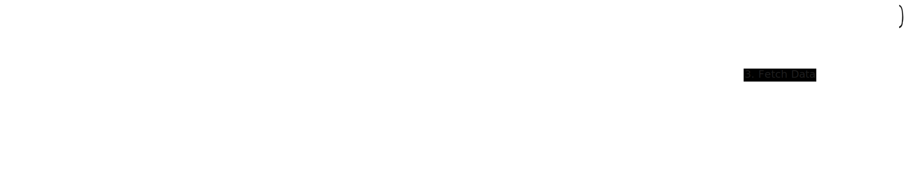

# 📈 Quant Trading Platform


**Go + Python + Next.js** 을 활용한 퀀트 투자 플랫폼입니다.

주가 데이터 수집부터 전략 백테스팅, 그리고 결과 시각화까지 하나의 통합된 환경에서 수행할 수 있도록 설계되었습니다.

---

## 🏗️ System Architecture

이 프로젝트는 **Turborepo**를 활용한 Monorepo 구조이며, 각 서비스는 **Docker Compose**를 통해 유기적으로 연결됩니다.


_(다이어그램 설명: Next.js 프론트엔드, Go API 게이트웨이, Python 퀀트 엔진, 그리고 Redis와 TimescaleDB 간의 데이터 흐름)_

### Core Components

| Service           | Tech Stack                     | Role                                                        |
| :---------------- | :----------------------------- | :---------------------------------------------------------- |
| **Frontend**      | Next.js (App Router), FSD Arch | 사용자 인터페이스, 전략 설정, 차트 시각화 (TradingView)     |
| **Backend API**   | Go (Fiber)                     | REST API Gateway, WebSocket(실시간 시세), 인증 및 유저 관리 |
| **Quant Engine**  | Python, Pandas, yfinance       | OHLCV 데이터 수집, 전략 백테스팅 연산, 지표 계산 워커       |
| **Message Queue** | Redis                          | Go와 Python 간의 비동기 작업 처리 (Job Queue)               |
| **Database**      | PostgreSQL (TimescaleDB)       | 시계열 데이터(주가) 및 관계형 데이터 저장                   |

---

## 📂 Project Structure

```bash
.
├── apps/
│   ├── web/        # Frontend (Next.js + Tailwind + FSD)
│   ├── server/     # Backend API (Go + Fiber)
│   └── engine/     # Quant Worker (Python + Pandas)
├── packages/       # Shared configs (UI Kit, TS Types)
├── infra/          # Infrastructure configurations (DB init scripts)
├── docker-compose.yml
└── README.md
```

---

## 🚀 Getting Started

로컬 개발 환경(Mac/Windows WSL)에서 프로젝트를 실행하는 가이드입니다.

### Prerequisites

- **Docker & Docker Compose** (필수 - DB 및 Redis 실행용)
- **Node.js** (v20+) & **pnpm** (패키지 매니저)
- **Go** (v1.21+)
- **Python** (v3.10+)

### 1. Installation

레포지토리를 클론하고 모노레포 의존성을 설치합니다.

```bash
git clone https://github.com/kim-dongho/quant-platform.git
cd quant-platform

# 모노레포 의존성 전체 설치 (Turborepo)
pnpm install
```

### 2. Run Infrastructure (DB & Redis)

애플리케이션을 띄우기 전에, 데이터베이스와 메시지 큐를 먼저 실행합니다.

```bash
# 백그라운드 모드(-d)로 DB와 Redis 실행
docker-compose up -d db redis
```

### 3. Run Applications (Dev Mode)

개발 스타일에 따라 두 가지 방법 중 하나를 선택하세요.

Option A: Docker로 전체 실행 (가장 간편) 설정이 완료된 후 전체 시스템을 테스트할 때 유용합니다.

```bash
docker-compose up --build
```

Option B: 개별 터미널 실행 (개발 시 추천) 각 서비스를 별도의 터미널에서 실행하여 로그를 실시간으로 확인하고 Hot-Reloading을 활용합니다.

```bash
# Terminal 1: Frontend (Next.js)

cd apps/web && pnpm dev

# Terminal 2: Backend API (Go)

cd apps/server && go run cmd/api/main.go

# Terminal 3: Quant Engine (Python)

cd apps/engine
source venv/bin/activate # 가상환경 활성화 (Windows: venv\Scripts\activate)
python src/main.py
```

---

## ✨ Key Features (Planned)

- [ ] **Data Pipeline**
  - `yfinance` 기반 미국 주식(RKLB, ASTS, SOUN 등) OHLCV 데이터 수집
  - 장 마감 후 일일 데이터 자동 업데이트 스케줄러 (Cron Job)
- [ ] **Backtesting Engine**
  - 기술적 지표(MACD, RSI, Bollinger Bands) 기반 전략 시뮬레이션
  - 수익률(CAGR), 최대 낙폭(MDD), 샤프 지수(Sharpe Ratio) 자동 계산
- [ ] **Interactive Dashboard**
  - TradingView 라이브러리를 활용한 고성능 캔들스틱 차트
  - 백테스팅 결과 시각화 및 매수/매도 타점 마킹
- [ ] **System Management**
  - 전략 파라미터(기간, 이평선 수치 등) GUI 설정
  - Redis Queue 모니터링 및 비동기 작업 상태 확인

---

## 🛠️ Tech Stack Detail

| Category     | Tech                        | Description                            |
| :----------- | :-------------------------- | :------------------------------------- |
| **Frontend** | **Next.js 14** (App Router) | FSD 아키텍처 적용, TailwindCSS Styling |
|              | **State Mgt**               | Zustand, TanStack Query                |
|              | **Charts**                  | TradingView Lightweight Charts         |
| **Backend**  | **Go** (Golang)             | Fiber Framework (REST API Gateway)     |
|              | **DB ORM**                  | Gorm or Sqlc                           |
| **Engine**   | **Python 3**                | Pandas, Numpy (데이터 연산 & 백테스팅) |
|              | **Data**                    | yfinance, ccxt                         |
| **Infra**    | **Docker**                  | Docker Compose 기반 로컬 환경          |
|              | **Database**                | PostgreSQL (TimescaleDB extension)     |
|              | **Queue**                   | Redis                                  |
