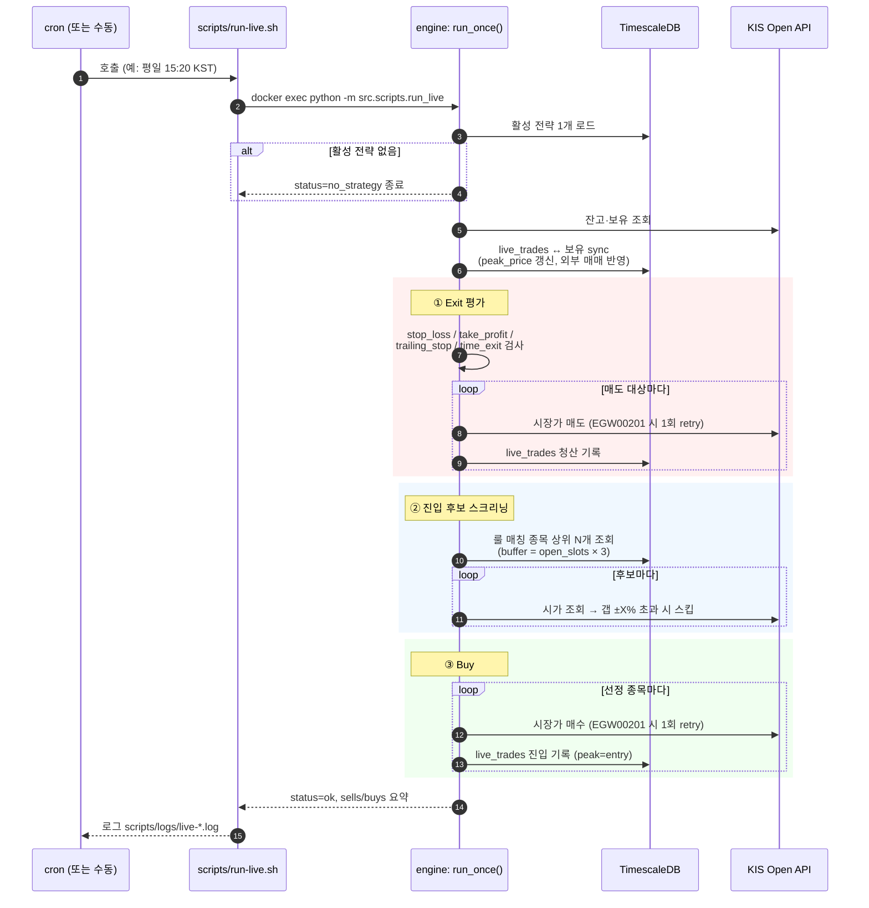

# `apps/engine` — 퀀트 엔진 (Python)

> FastAPI · pandas · TimescaleDB · yfinance · FinanceDataReader · KIS Open API

## 목차

1. [개요](#1-개요)
2. [책임 영역](#2-책임-영역)
3. [디렉토리 구조](#3-디렉토리-구조)
4. [환경 설정](#4-환경-설정)
   - [4.1 환경변수](#41-환경변수)
   - [4.2 KIS Open API 키 발급](#42-kis-open-api-키-발급)
5. [시세 수집 (Universe Ingestion)](#5-시세-수집-universe-ingestion)
   - [5.1 지원 유니버스](#51-지원-유니버스)
   - [5.2 실행 방법](#52-실행-방법)
6. [라이브 자동매매](#6-라이브-자동매매)
   - [6.1 동작 방식](#61-동작-방식)
   - [6.2 트리거 + cron 등록](#62-트리거--cron-등록)
   - [6.3 운영 주의](#63-운영-주의)
7. [API 라우트](#7-api-라우트)
8. [데이터베이스 스키마](#8-데이터베이스-스키마)

---

## 1. 개요

플랫폼의 **데이터·연산 계층**입니다. 시세 수집, 백테스트, 전략 자동 탐색,
라이브 자동매매까지 퀀트 로직 전반을 이 엔진이 담당합니다.

`apps/server` (Go) 는 이 엔진 위의 얇은 게이트웨이 역할을 하며, 프론트의
모든 요청을 FastAPI 엔드포인트(`http://engine:8000`) 로 프록시합니다.
엔진이 직접 호출하는 외부 API는 두 곳입니다.

- **데이터 소스** — `yfinance` (미국), `FinanceDataReader` (한국)
- **증권사 API** — 한국투자증권 (KIS) Open API (모의·실전 계좌)

저장소는 **TimescaleDB** 를 사용합니다. OHLCV 는 hypertable, 팩터·라이브
거래·전략은 일반 테이블로 관리합니다. (스키마 요약은 [§8](#8-데이터베이스-스키마))

## 2. 책임 영역

엔진의 책임은 다섯 도메인으로 나뉩니다. 각 도메인은 `src/service/<name>/` 와
`src/api/routers/<name>.py` 로 1:1 매핑됩니다.

| 도메인        | 입력                               | 출력                          | 트리거                                                |
| ------------- | ---------------------------------- | ----------------------------- | ----------------------------------------------------- |
| **Ingest**    | yfinance / FinanceDataReader 시세  | `market_data` hypertable      | `scripts/ingest-universe.sh` (수동·cron)              |
| **Factor**    | `market_data` OHLCV                | `factors` 테이블 (RSI, SMA…)  | Ingest 직후 자동 계산                                 |
| **Backtest**  | 전략 룰 + 기간                     | 누적 수익률·MDD·CAGR·승률     | `POST /portfolio/backtest`                            |
| **Discover**  | 시도할 팩터 목록 + universe        | 상위 N개 룰 (학습/검증 α 평균) | `POST /portfolio/discover/start` (비동기 job)         |
| **Live**      | 활성 전략 + KIS 계좌               | KIS 주문 발송 + 청산 기록     | `scripts/run-live.sh` (수동·cron, 종가 매매)          |

이 외에 KIS API 잔고·주문·시세 조회를 그대로 노출하는 **Paper** 라우터가
있지만, 이건 단순 프록시라 별도 도메인으로 분류하지 않았습니다.

## 3. 디렉토리 구조

```
apps/engine/
├── src/
│   ├── main.py                 # FastAPI 엔트리 + DB schema 초기화 lifespan
│   ├── api/routers/            # HTTP 엔드포인트 (도메인별 1파일)
│   │   ├── backtest.py
│   │   ├── live.py
│   │   ├── market.py
│   │   ├── paper.py            # KIS 잔고·주문·시세 프록시
│   │   ├── portfolio.py        # 스크리닝·백테스트·discover
│   │   └── stocks.py
│   ├── service/                # 비즈니스 로직 (라우터에서 분리)
│   │   ├── backtest/           # 백테스트 엔진 (vectorized + discover grid search)
│   │   ├── factor/             # RSI·SMA·vol_ratio 등 팩터 계산·저장
│   │   ├── ingest/             # yfinance(미국) / FDR(한국) 적재
│   │   ├── kis/                # KIS Open API 클라이언트 (토큰·주문·잔고)
│   │   ├── live/               # 라이브 자동매매 — strategy/executor/trades
│   │   └── market/             # 거래일·세션 헬퍼
│   ├── scripts/                # 컨테이너 안에서 1회성 실행 (Python module)
│   │   ├── discover.py         # grid search 비동기 워커 진입점
│   │   ├── ingest_bulk.py      # 유니버스 일괄 적재
│   │   └── run_live.py         # 라이브 매매 1회 실행
│   ├── core/
│   │   ├── config.py           # 유니버스 정의 (sp500/krx350 등) + DB DSN
│   │   └── database.py         # SQLAlchemy 엔진·세션·init_db
│   └── util/                   # (현재 비어 있음)
├── migrations/
│   └── schema.sql              # 단일 idempotent 스키마 (lifespan 에서 자동 적용)
├── Dockerfile
└── requirements.txt
```

위치 선택 가이드:

- HTTP 핸들러 추가는 **api/routers/** — 한 도메인은 한 파일.
- 재사용 가능한 로직은 **service/<domain>/** — 라우터는 가능한 얇게, 실제 작업은 service 에.
- 1회성 운영 작업은 **scripts/** — `python -m src.scripts.<name>` 형태로 호출
  (`scripts/run-live.sh`, `scripts/ingest-universe.sh` 가 래퍼).

## 4. 환경 설정

### 4.1 환경변수

엔진 컨테이너는 `docker-compose.yml` 의 `engine` 서비스를 통해 환경변수를
받습니다. DB·Redis 접속 정보는 compose 가 자동으로 주입하므로 신경 쓸 필요 없고,
**KIS 관련 5개 변수만 레포 루트의 `.env` 에 채워주면 됩니다.**

```bash
# .env (레포 루트)
KIS_APP_KEY=PSxxxxxxxxxxxxxxxxxxxxxxxxxxxxxxxx
KIS_APP_SECRET=xxxxxxxxxxxxxxxxxxxxxxxxxxxxxxxxxxxxxxxxxxxxxxxxxxxxx
KIS_ACCOUNT_NUMBER=12345678          # 8자리 계좌번호 (상품코드 제외)
KIS_ACCOUNT_PRODUCT_CODE=01          # 종합계좌 = 01 (생략 시 기본값)
KIS_MODE=paper                       # paper | real (생략 시 paper)
```

| 변수                        | 필수 | 설명                                                               |
| --------------------------- | ---- | ------------------------------------------------------------------ |
| `KIS_APP_KEY`               | ✅   | KIS Developers 에서 발급받은 앱 키. **모의·실전이 별도 키.**       |
| `KIS_APP_SECRET`            | ✅   | 앱 시크릿. 노출 금지.                                              |
| `KIS_ACCOUNT_NUMBER`        | ✅   | 계좌번호 앞 8자리 (상품코드 제외).                                 |
| `KIS_ACCOUNT_PRODUCT_CODE`  | ⬜   | 보통 `01` (종합매매). 다른 상품 쓰면 변경.                         |
| `KIS_MODE`                  | ⬜   | `paper` (모의) / `real` (실전). 미지정 시 모의투자로 안전하게 시작. |

`KIS_MODE` 에 따라 base URL 과 tr_id 가 자동 분기됩니다 (`src/service/kis/client.py`):

- `paper` → `https://openapivts.koreainvestment.com:29443`
- `real`  → `https://openapi.koreainvestment.com:9443`

토큰은 24시간 TTL 로 발급되며, 클라이언트가 만료 5분 전에 자동 재발급합니다.

### 4.2 KIS Open API 키 발급

한국투자증권 [KIS Developers 포털](https://apiportal.koreainvestment.com/) 에서
발급받습니다. 모의·실전이 같은 사이트지만 키는 따로 신청해야 합니다.

1. **계좌 개설** — 한투 앱에서 종합매매 계좌가 있어야 합니다. 모의투자만
   할 거라면 별도 모의 계좌 발급도 필요합니다 (앱 → 모의투자).
2. **개발자 등록** — KIS Developers 포털 로그인 후 **앱 등록**. 사용 목적·웹훅 URL
   (없으면 임의값) 을 입력하면 즉시 `APP_KEY` / `APP_SECRET` 이 발급됩니다.
3. **모의 / 실전 분기** — 같은 절차로 두 번 발급해야 합니다.
   - **실전 (real)**: 앱 등록 시 "실전투자" 선택. 실제 자금 거래.
   - **모의 (paper)**: 앱 등록 시 "모의투자" 선택. 가상 자금. **개발·테스트는 항상 이쪽으로.**
4. **계좌번호 확인** — 앱 또는 HTS 의 계좌번호 (예: `12345678-01`) 에서
   `-` 앞 8자리가 `KIS_ACCOUNT_NUMBER`, 뒤 2자리가 `KIS_ACCOUNT_PRODUCT_CODE` 입니다.

> ⚠️ `.env` 는 `.gitignore` 에 포함되어 있는지 반드시 확인하세요. APP_SECRET 이
> 깃 히스토리에 들어가면 즉시 KIS 포털에서 재발급해야 합니다.

## 5. 시세 수집 (Universe Ingestion)

### 5.1 지원 유니버스

`src/core/config.py` 의 `UNIVERSE_NAMES` 에 정의되어 있습니다. 미국은
Wikipedia·iShares 가, 한국은 FinanceDataReader 가 소스입니다.

| 이름           | 시장   | 종목 수 (대략) | 데이터 소스                                    |
| -------------- | ------ | -------------- | ---------------------------------------------- |
| `watchlist`    | US     | 30             | 하드코딩 (테마주 — 우주/AI/반도체/EV 등)       |
| `sp500`        | US     | 500            | Wikipedia "List of S&P 500 companies"          |
| `nasdaq100`    | US     | 100            | Wikipedia "Nasdaq-100"                         |
| `russell1000`  | US     | ~1000          | iShares IWB ETF holdings CSV                   |
| `russell2000`  | US     | ~2000          | iShares IWM ETF holdings CSV                   |
| `russell3000`  | US     | ~3000          | `russell1000 ∪ russell2000`                    |
| `kospi200`     | KR     | 200            | FinanceDataReader (KOSPI 시총 상위 200)        |
| `kosdaq150`    | KR     | 150            | FinanceDataReader (KOSDAQ 시총 상위 150)       |
| `krx350`       | KR     | ~350           | `kospi200 ∪ kosdaq150`                         |

**기본 적재 대상** (`get_all_ingest_universe`) — 미국 R1000 ∪ R2000 ∪ NASDAQ100 +
SPY (벤치마크), 한국 KRX350 합집합입니다.

> KOSPI 200 / KOSDAQ 150 은 공식 지수의 시총 가중·유동 주식 기준과 미세하게
> 다른 시총 상위 N 근사치입니다. 백테스트·자동탐색 결과에는 영향 없는
> 수준이지만, 정확한 지수 추종이 필요하면 별도 유니버스 정의가 필요합니다.

### 5.2 실행 방법

`scripts/ingest-universe.sh` 가 컨테이너 안에서 `python -m src.scripts.ingest_bulk`
를 호출합니다. 호스트에서 한 줄로 실행하면 됩니다.

```bash
# 기본 — 미국(R1000∪R2000∪NDX100+SPY) ∪ 국내(KRX350) 10년치 OHLCV + 팩터
./scripts/ingest-universe.sh

# 일부 유니버스만
./scripts/ingest-universe.sh --universe sp500
./scripts/ingest-universe.sh --universe krx350

# 빠른 검증 — 처음 200종목만
./scripts/ingest-universe.sh --universe sp500 --limit 200

# 직접 종목 리스트 지정 (한 줄에 한 티커)
./scripts/ingest-universe.sh --tickers-file /tmp/my-list.txt

# 백그라운드 실행 (긴 작업, 로그는 scripts/logs/ingest-*.log 에 자동 기록)
nohup ./scripts/ingest-universe.sh > /dev/null 2>&1 &
```

주요 동작:

- 미국·한국 자동 분기 — `.KS` / `.KQ` 접미사면 FinanceDataReader, 그 외는 yfinance.
- **증분 수집** — 이미 적재된 종목은 마지막 날짜 이후만 요청.
- yfinance 는 `yf.download()` multi-ticker batch (배치 100) 로 호출 횟수 절약.
- 적재 직후 RSI / SMA / vol_ratio 등 **factor precompute** 까지 자동 수행
  (`--skip-factors` 로 생략 가능).
- 실패/상폐 종목은 로그에만 남기고 전체는 계속 진행.

**처음 한 번** 적재는 R3000 + KRX350 기준 30~60분 정도 걸립니다.
두 번째부터는 증분이라 보통 1~3분 내에 끝납니다.

## 6. 라이브 자동매매

### 6.1 동작 방식

라이브 매매는 **데몬이 아니라 1회 실행 (one-shot)** 입니다. cron 이 매일
정해진 시각에 호출하면, 엔진은 활성 전략 1개를 읽어 매도·매수 한 라운드를
돌고 종료합니다. 상태는 DB (`live_trades`) 에 영속화됩니다.



핵심 동작:

- **단일 활성 전략**: `live_strategies` 테이블에 활성=true 인 행은 1개만 허용
  (UI 에서 전략 활성화 시 기존 활성 전략 자동 비활성화).
- **외부 매매 sync**: KIS 앱에서 직접 사고팔아도 다음 실행 시 `live_trades` 가
  맞춰집니다. `peak_price` 도 매 라운드 갱신 (trailing stop 정확도용).
- **Exit 우선** — 매도가 먼저 끝난 뒤 빈 슬롯 만큼만 매수 (cash 이중사용 방지).
- **Gap 필터** — 시가 갭이 ±X% 초과면 매수 스킵 (장 시작 충격 회피).
- **Dry run** — `--dry-run` 으로 KIS 호출 없이 시뮬레이션. DB 도 건드리지 않습니다.

### 6.2 트리거 + cron 등록

`scripts/run-live.sh` 가 컨테이너 안의 `run_live` 모듈을 실행합니다.

```bash
# 수동 실행 (테스트)
./scripts/run-live.sh --dry-run    # 주문 발송 없이 시뮬레이션
./scripts/run-live.sh              # 실제 매매 (KIS_MODE=paper면 모의계좌)

# JSON 결과 보고서로 저장
./scripts/run-live.sh --json-out /tmp/live-result.json
```

cron 등록 — 평일 한국 시장 동시호가 직전 (15:20 KST) 에 실행:

```bash
# crontab -e
20 15 * * 1-5  cd /path/to/repo && ./scripts/run-live.sh > /dev/null 2>&1
```

엔진 컨테이너가 떠 있어야 하므로, 호스트에서 `docker-compose up -d` 가
선행되어야 합니다. 자동 기동을 원한다면 시스템 부팅 시 docker-compose 가
올라가도록 설정해두는 것을 추천합니다.

로그는 `scripts/logs/live-YYYYMMDD-HHMMSS.log` 에 자동 저장됩니다.

### 6.3 운영 주의

**KIS 호출 빈도 (rate limit)**
- 모의계좌는 **초당 2건**, 실전은 **초당 20건** 이 한계입니다.
- 초과 시 `EGW00201` 에러로 거부되며, 엔진은 자동으로 0.5초 대기 후 1회
  재시도합니다. 그래도 실패하면 해당 주문만 스킵하고 다음으로 진행합니다.
- 보유 종목·후보가 많으면 한 라운드 안에서 자연스럽게 sleep 이 누적됩니다
  (`KIS_QUOTE_SLEEP_SEC`, 기본 0.5s).

**동시호가 (15:20–15:30 KST) 시장가 주문**
- 한국 시장은 종가 결정을 위해 마지막 10분이 단일가 매매로 전환됩니다.
- 이 시간대에 발송된 시장가 주문은 즉시 체결되지 않고 **15:30 종가에 일괄
  체결**됩니다. 즉, 실행 직후 `잔고 조회` 에 반영되지 않을 수 있어
  보유 종목이 0 으로 보일 수 있는데 정상 동작입니다.

**활성 전략 변경**
- UI 에서 전략을 변경하면 기존 활성 전략은 자동 비활성화됩니다. cron 이
  도는 시점의 `is_active=true` 행 하나가 그날 매매에 사용됩니다.
- 룰을 도중에 바꿀 거면 다음 실행 직전에 변경하세요. 매수와 매도 사이에
  바뀌면 매도 평가는 옛 룰로, 매수는 새 룰로 진행됩니다 (의도된 사이드 효과
  없음 — exit policy 와 entry clauses 를 분리해서 관리하니).

**실전 전환 (`KIS_MODE=real`)**
- `.env` 의 `KIS_MODE=real` + 실전 키로 교체 후 컨테이너 재기동.
- 첫 실행은 반드시 `--dry-run` 으로 검증하세요. 실전 키와 모의 키는 별개의
  계좌·잔고를 가집니다.

## 7. API 라우트

엔진은 FastAPI 로 `:8000` 포트에 노출되며, `apps/server` (Go) 가 같은 경로를
`/api/...` 로 그대로 프록시합니다. 따라서 프론트는 항상 Go 서버를 거칩니다.

| Prefix         | 엔드포인트                          | 메서드  | 용도                                                      |
| -------------- | ----------------------------------- | ------- | --------------------------------------------------------- |
| `/backtest`    | `/`                                 | POST    | 단일 종목 백테스트 (지표 기반 매매 시뮬레이션)            |
|                | `/ingest/{ticker}`                  | POST    | 종목 OHLCV 즉시 적재 (lazy ingest 진입점)                 |
| `/portfolio`   | `/screen`                           | POST    | 룰 매칭 종목 상위 N개 반환 (오늘의 추천)                  |
|                | `/backtest`                         | POST    | 룰 기반 누적 수익률·MDD·CAGR 시뮬레이션                   |
|                | `/discover`                         | POST    | grid search 동기 호출 (작은 풀에서만 권장)                |
|                | `/discover/start`                   | POST    | 비동기 grid search 시작 → `{ job_id }` 반환               |
|                | `/discover/status/{job_id}`         | GET     | 진행률·결과 polling (status / done / total / result)      |
| `/live`        | `/strategy`                         | GET     | 활성 전략 1개 조회 (없으면 null)                          |
|                | `/strategy`                         | POST    | 활성 전략 upsert (기존 활성 전략은 자동 비활성화)         |
|                | `/strategy`                         | DELETE  | 활성 전략 중지                                            |
| `/paper`       | `/balance`                          | GET     | KIS 잔고·보유 조회 프록시                                 |
|                | `/orders`                           | GET     | 체결 내역 조회 (start/end_date 옵션)                      |
|                | `/orders`                           | POST    | 주문 발송 (`symbol`, `qty`, `side`, `order_type`, `price?`) |
|                | `/quote/{symbol}`                   | GET     | 국내주식 현재가                                           |
| `/market`      | `/last_session`                     | GET     | NASDAQ 기준 가장 최근 마감 거래일                         |
| `/stocks`      | `/list`                             | GET     | DB 에 적재된 심볼 목록                                    |

OpenAPI / Swagger UI 는 자동 생성됩니다.

```bash
http://localhost:8000/docs           # Swagger UI
http://localhost:8000/openapi.json   # 스펙 JSON
```

> 동일 라우트가 `apps/server` (Go) 에도 있는데, 거의 모든 핸들러는 단순
> 엔진 프록시입니다. 비즈니스 로직 변경은 **이 엔진** 에서 하면 됩니다.

## 8. 데이터베이스 스키마

스키마 정의는 `migrations/schema.sql` 한 파일에 모여 있고, **idempotent**
하게 작성되어 있어 엔진 기동 시 (`main.py` 의 lifespan) 자동 적용됩니다.
별도 마이그레이션 도구는 사용하지 않습니다 — 컬럼 추가 시 `ALTER TABLE …
ADD COLUMN IF NOT EXISTS` 형태로 보강하는 패턴만 지킵니다.

| 테이블             | 종류        | 핵심 컬럼                                                       | 용도                                                |
| ------------------ | ----------- | --------------------------------------------------------------- | --------------------------------------------------- |
| `stocks`           | 일반        | `symbol` PK, `name`, `exchange`                                 | 종목 메타데이터 (회사명·거래소)                     |
| `market_data`      | hypertable  | (`time`, `symbol`) PK, OHLCV                                    | 일봉 OHLCV — 모든 백테스트·팩터 계산의 입력         |
| `factors`          | hypertable  | (`time`, `symbol`) PK, RSI/SMA/vol_ratio 등 10개                | 일자별 정규화 팩터 — 스크리닝·discover 의 인덱스    |
| `portfolio_rules`  | 일반        | `id`, `name`, `config` JSONB                                    | UI 에서 저장한 룰셋 (백테스트 페이지 프리셋)        |
| `live_strategies`  | 일반        | `id`, `is_active`, `clauses`/`exit_policy` JSONB                | 라이브 활성 전략. **partial unique index 로 활성 1개 제한** |
| `live_trades`      | 일반        | `strategy_id`, `symbol`, `entry_date`, `peak_price`, `exit_*`   | 라이브 진입·청산 로그. trailing_stop·time_exit 의 진입일·peak 추적 |

핵심 인덱스:

- `ix_symbol_time_desc` (`market_data`) — 종목별 최근 N봉 조회
- `ix_factors_symbol_time_desc` / `ix_factors_time_desc` — 스크리닝 (특정 일자 N등분 percentile) 과 종목별 시계열 양쪽 빠르게
- `ux_live_strategies_active` — `WHERE is_active` partial unique → 활성 전략 1개 제약을 DB 레벨에서 강제
- `ux_live_trades_open` — `WHERE exit_date IS NULL` partial unique → 한 전략에서 같은 심볼의 open trade 중복 방지

스키마 변경 시 가이드:

1. `migrations/schema.sql` 에 `CREATE TABLE IF NOT EXISTS` / `ALTER TABLE …
   ADD COLUMN IF NOT EXISTS` 추가.
2. 엔진 컨테이너 재기동만 하면 자동 적용 (`docker-compose restart engine`).
3. 운영 DB 가 이미 있다면 `IF NOT EXISTS` 덕분에 안전하게 적용됩니다.
